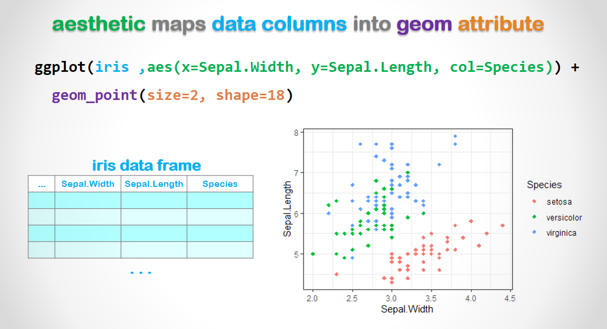

```{r echo=F, results='hide', message=FALSE, warning=FALSE}
# 安裝、設定和格式化，不要修改此程式區塊。
rm(list=ls(all=T))
knitr::opts_chunk$set(comment = NA)
knitr::opts_knit$set(global.par = TRUE)
par(cex=0.7) 
options(scipen=20, digits=4, width=80, tibble.print_min=3)
# rmarkdown::find_pandoc(version = '2.7.3')

if(!require(pacman)) install.packages("pacman")
if(!require(dplyr)) install.packages("dplyr")
if(!require(tidyr)) install.packages("tidyr")
if(!require(ggplot2)) install.packages("ggplot2")
if(!require(plotly)) install.packages("plotly")
```

<br><br><p class="wwl"><span style='font-size:24px'> 🏠 </span>
<span style='font-size:14px; font-family:"Arial Black"'>
<b><u>重點提要:</u></b></span><br>
這一份程式筆記有兩個學習目標：<br>
&emsp; ■`ggplot2`套件的介紹<br>
&emsp; ■ 體驗資料視覺化的威力<br>
`ggplot`是資料框視覺化的主流工具<br> 
&emsp; ■ 每一筆資料**對應**到一個繪圖元件(`geom_...`)，如<br>
&emsp; &emsp; &emsp; ◇ `geom_point` : 點狀圖上的一個點 <br>
&emsp; &emsp; &emsp; ◇ `geom_bar`, `geom_col` : 柱狀圖上的一根柱 <br>
&emsp; &emsp; &emsp; ◇ `geom_line` : 折線圖上的一個轉折點 <br>
&emsp; ■ 每一個欄位**對應**到一個繪圖元件的屬性， <br>
&emsp; &emsp; &emsp; ◇ 如點的座標、顏色、大小、形狀等等<br>
</p class="wwl"><br>

{width=600}

🌻 `ggplots`中的基本程式碼元素為 ...

+ `ggplot`將資料框繪製到圖中
+ `aes`指定變數的繪圖元件隨資料改變的屬性(如X、Y座標，顏色)
+ `geom` 每一筆資料對應到一個繪圖元件
+ 不隨資料改變的繪圖元件屬性(如形狀、大小)可以直接在幾何圖層(`geom`)中指定

<br>

載入library裡面的套件
```{r}
pacman::p_load(dplyr,tidyr,ggplot2,plotly,gridExtra)
theme_set(theme_get() + theme(# set common plotting formats
  text=element_text(size=8), legend.key.size=unit(10,"points")
  ))
```

### 1. 一個簡單的例子

在R中繪圖很容易，讓我們使用R的內建數據`iris` 作為快速入門的例子。

```{r message=FALSE, warning=FALSE}
head(iris)
table(iris$Species)
```

在`iris`資料框中，有3個不同種類，共150朵鳶尾花。

```{r fig.height=3, fig.width=5.5}
ggplot(iris, aes(x=Sepal.Width, y=Sepal.Length, color=Species)) + 
  geom_point(size=2, shape=18) + theme_bw()
```

使用`geom_point()`，`iris`中的每一朵花都被繪製為一個點，它們的`Sepal.Width`、`Sepal.Length` 和`Species` 分別對應到每個點的x、y坐標和顏色。點的靜態屬性(The static attribute of the points)，例如`size`和`shape`，則直接在`geom_()`中指定。

<br><br>


### 2. 點狀圖的功能

🌻 探索性分析的主要目的是：

+ 在分析對象之間做比較  
+ 在變數之間找關係

我們再次使用漫畫人物資料集來做例子 
```{r}
D = read.csv("./data/comics1.csv",stringsAsFactors=F)
glimpse(D)
```

先畫一個簡單的點狀圖
```{r fig.height=3, fig.width=5}
ggplot(D, aes(year,appearances)) + geom_point() 
```

圖看起來很漂亮，但能看到什麼資訊呢？你能說出誰是出場次數最多的角色嗎？讓我們來做一些改善。<br><br>


<span style="font-size:18px"> 🚴  練習2A </span><br>
逐步加入以下程式並觀察它們的效果...<br>
&emsp; ■ 把 `color=sex, shape=align` 等參數，放入 `aes()`裡面<br>
&emsp; ■ 把 `+ scale_y_log10()` 放在後面 <br>
&emsp; ■ 把 `+ facet_wrap(~publisher)` 放在後面 <br>
圖的資訊含量變大了，但是它是不是變得非常凌亂呢？ <br><br>
```{r}
ggplot(D, aes(year,appearances,color=sex, shape=align)) + geom_point() + scale_y_log10()+ facet_wrap(~publisher)
```


🌻 資料視覺化的兩個目標：「資訊含量」和「簡單清楚」常常是互相衝突的 <br>
🌻 想要同時滿足這兩項目標，關鍵在於「互動性」  

<br><br>

<center>
{height=80}
</center>

##### 2.1 忍者道場- 互動式圖形

```{r}
# take 100 most appearing characters from each publisher
gg = D %>% group_by(publisher) %>%     # from each publisher   
  top_n(n=100, wt=appearances) %>%     # pick out 100 most appearing roles
  ggplot(aes(x=year,y=appearances,color=sex,shape=align, label=name)) +    
  scale_y_log10() + 
  facet_wrap(~publisher) +
  geom_point(alpha=0.8) +              # set transparency & size
  theme_bw() +                         # choose a theme for clarity
  theme(text=element_text(size=9)) +   # use smaller font
  labs(title="The Most Appearings",
       x="", y="", color="", shape="") #  set plot and the axis titles 
```
我們先將圖形物件保存在叫做`gg`的物件裡，接著我們利用`plotly::ggplotly()`讓圖形變成可以互動

```{r fig.height=3.5, fig.width=7}
ggplotly(gg)
```


🚴 讓我們來體驗一下圖形的**互動性**吧 ... 

+ 將鼠標停在標記上以查看工具提示
+ 單擊（或雙擊）上方工具例以選擇特定的功能
+ 在繪圖區域內拖曳想要放大的區塊
+ 單擊上方工具例中的 🏠 圖示即可恢復原狀

<br>

🚴 直接從圖表中，您可以回答一些複雜的問題，像是...

+ DC 和 marvel 出現次數最多的角色分別是誰? DC batman,marvelspider-man
+ 誰是最常出現的女性好人角色? Susan Storm
+ 最後出現的女性中立角色是誰? Emma Frost
+ 女性好人角色的出現次數會隨時間變化嗎? 會,以dc來說隨著時間，女性好人角色變多但各自的出現次數下降

<br>

🌻 回答上述某些問題，過去需要接受認真的統計學訓練。現在，有了互動式圖表，即使你根本沒有學過統計學，也可以直接**觀察到**答案。

<br>


##### 2.2 可互動式圖形的威力

在學習繪圖的更細節的語法之前，你應該已經體驗過視覺化的威力了

🌻 互動性是現代資料視覺化的重要功能

+ 縮小時，你可以縱觀整張圖，像是...
  + 每種類型的角色在時間上是如何分佈的
  +  `year` 與 `appearances`之間的關係
  + `sex`, `align` 和 `publisher`之間的關係是如何變化的
+ 當你放大時，你可以看到細節，像是...
  + 觀察離群值的資料點 和 
  + 檢查每個角色的名字和特徵

🌻 建立了<z>資料欄位</z>和<z>繪圖原件屬性</z>之間的<z>對應關係</z>之後，我們可以在同一張圖上面同時比較高達七個變數，包括：x, y, size, color, shape 和兩個 facet dimensions.

<br><br>

### 3. 動態與互動式圖表

讓我們在另一個例子中示範互動式圖表的分析能力

🌻 如果我們想調查

+ 角色外表（特別是`頭髮`和`眼睛`顏色）和陣營（`align`）、性別（`sex`）和傷亡（`alive`）這些變數之間的相關性 

+ 並且，這些變數之間的關係如何隨時間變化？

以往我們需要建一些複雜的模型才能回答這些研究問題，現在我們可以使用互動圖表中直接回答這些問題。  首先我們需要準備資料，讓我們把時間軸設定在 1980 年至 2010 年，並將這段時間以5年為一個區間
```{r message=FALSE, warning=FALSE}
breaks=seq(1980,2010,5)
D2 = filter(D, year>=1980, year<=2010) %>%       # set the time period
  mutate(
    period = cut(year,breaks,breaks[-1],T) %>%   # cut them into 5yr period        
      as.character %>%  # by default cut() returns a factor, but 
      as.integer        # we'd liker to have an integer here 
  )
```

然後我們計算每種頭髮-眼睛顏色組合的數量，並計算它們的占比和累計占比。
```{r message=F, warning=F}
outlooks = count(D2, hair, eye, sort=T) %>%      # count and sort 
  mutate(share=100*n/sum(n), cum=cumsum(share))  # shares and accumulation
head(outlooks, 20)
```
前 10 名的組合大概覆蓋了三分之二的人口。 

資料裝配線： 在下面的程式區塊，我們示範如何運用管線符號(%>%)來建立一條資料裝配線。乍看之下，管線符號(%>%)可能會令人緊張，不過它不是一次就建立完成的，讓我們來介紹如何從頭開始逐步建立流水線吧!

```{r fig.height=4, fig.width=6}
inner_join(D2, outlooks[1:10,]) %>%    # filter for the top 10 outlooks 
  group_by(hair, eye) %>% summarise(   # group by hair and eye
    n = n(),                           # count the no. characters
    female=mean(sex=="Female"),        # the share of female
    bad=mean(align=="Bad"),            # the share of bad guys    
    dead=mean(alive=="Deceased"),      # the casualty ratio
    .groups='drop') %>%                # drop the remaining group
  ggplot(aes(bad, dead)) +             # map x and y coordinates
  geom_point(aes(col=female, size=n), alpha=0.8) +   # map size and color
  scale_color_gradientn(colors=c("seagreen","gold","red")) +  # set color scale
  scale_size_continuous(range=c(3,12)) +             # set size scale          
  geom_text(aes(label=paste(hair,eye,sep="\n")), size=3) # put on a text label
```

上面的圖表是有資訊含量的。 但是還不夠好...

+ 首先，它是靜態的。所以我們看不到關係是如何隨時間變化的。
+ 而且，如果我們想在圖表中加入更多的外貌種類，它會變得太擁擠而難以閱讀。

動態和互動式圖表可以解決這些問題。 在下面的程式區塊中，我們做了一些修改...

+ 我們放入了前 18 名的外貌種類，涵蓋了 75% 的角色 
+ 除了`hair`和`eye`，我們還按`period`分組，在每個`period`都建了一個資料框 
+ 我們新增了一個用於標記的欄位`hair.eye`
+ ggplot 部分基本上保持不變。 然而，
  + 在 `aes()` 中我們添加了參數`frame=period` 用於動態顯示
  + 我們先不繪製它而是將它保存為一個物件`gg` 
+ 最後，我們通過`ggplotly`變成互動式圖表 

```{r}
gg = inner_join(D2, outlooks[1:18,-3]) %>% 
  group_by(period, hair, eye) %>% summarise(
    n = n(), bad=mean(align=="Bad"), female=mean(sex=="Female"),
    dead=mean(alive=="Deceased"), .groups='drop') %>% 
  mutate(hair.eye = paste(hair,eye,sep=".")) %>% 
  ggplot(aes(bad, dead, label=hair.eye)) + 
  scale_color_gradientn(colors=c("seagreen","gold","red")) +
  scale_size_continuous(range=c(2,12)) +
  geom_point(aes(col=female, size=n, frame=period), alpha=0.8)
ggplotly(gg) %>% animation_opts(100)
```

按左下角的“播放”按鈕，看看會發生什麼。 如果單獨移動滑桿，我們會發現大部分時間、大多數泡泡都聚集在一個區域。但是這些區域的位置、形狀和顏色會隨著時間變化，例如：(a)在2000年期間，我們看到紅色氣泡明顯低於綠色氣泡，這表示男性角色的傷亡率更高；(b)在1990 年，`dead`似乎與`bad`呈負相關，這意味著壞角色比好角色傷亡率低。

除了群體現象，我們還可以追踪每個氣泡，看看它的陣營、性別和死亡率是如何隨時間變化的。例如，`no-hair.green-eyes`大多數情況下是男性和壞人，但它們的數量（泡泡大小）和死亡率在 30 年內發生了很大變化。 

從社會學的觀點，上述現象和趨勢都可以算是重要的發現，但傳統的數學模型中很難出這些資訊，這種探索能力正是動態、互動式圖表最重要的價值。


<br><br>


