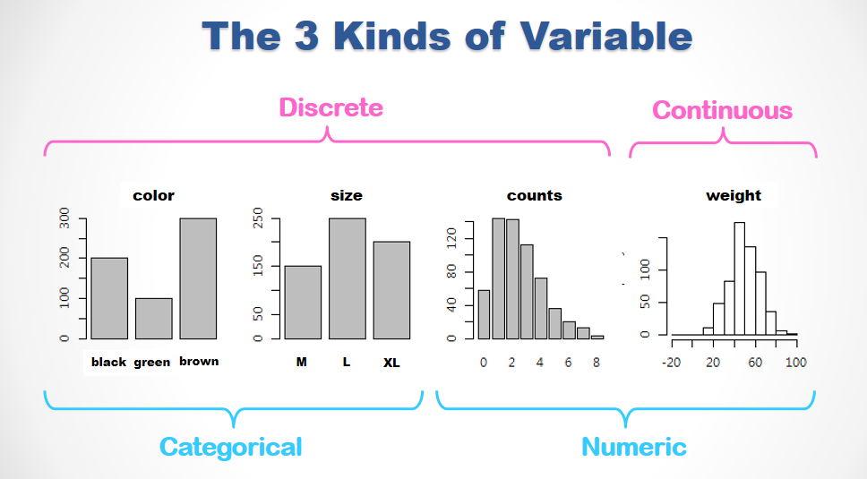
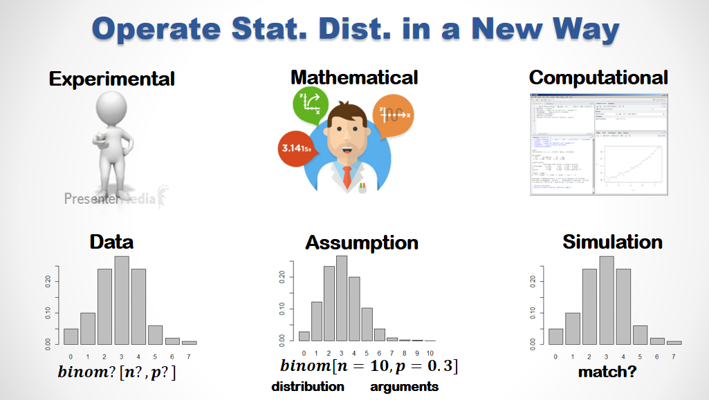

```{r results='hide', message=FALSE, warning=FALSE, echo=F}
# Installation, setup & formatting. Do not modify this code chunk.  
rm(list=ls(all=T))
knitr::opts_chunk$set(comment = NA)
options(scipen=20, digits=5, width=80, tibble.print_min=4)
rmarkdown::find_pandoc(version = '2.7.3')
```
<br><br><hr>

<span style='font-size:16px; font-family:"Arial Black"'>
<b><u>👨‍🏫 **KEY POINTS :**</u></b></span><br>

🔑 Distribution: the connections among probability, probability density and probability density functions (PDF/CDF).

🔑 3 different types of variables. Each has a distinctive distribution form.  

🔑 A same set of operations generally apply to all kinds of distribution.

🔑 Put distribution functions in use.

🔑 Define random variables by simulating random experiment 

<br><hr>


```{r results='hide', message=FALSE, warning=FALSE}
pacman::p_load(dplyr, vcd, future.apply)
plan(multisession)
```


### 1. The 3 types of Variable/Distribution

There are 3 types of variables. <z>Categorical</z> variables are always discrete. Their distributions are represented by counts and barplots. Numerical variables are either <z>Discrete</z> (integers) or <z>Continuous</z> (real numbers). The former are visualized by barplots and the latter histograms. The distributions of both <z>Numeric</z> types may be precisely specified by mathematical formula named after <z>PDF</z> and <z>CDF</z>. 

{height=400}

<br>

##### 1.1 Built-in Distribution Functions

Most of the commonly used distributions functions are built-in in R (See the online help of `distributions` for details.)

+ beta : `dbeta()`
+ binomial : `dbinom()`
+ Cauchy : `dcauchy()`
+ chi-squared : `dchisq()`
+ exponential : `dexp()`
+ F : `df()`
+ gamma : `dgamma()`
+ geometric : `dgeom
+ hypergeometric : `dhyper()`
+ log-normal : `dlnorm()`
+ multinomial : `dmultinom()`
+ negative binomial : `dnbinom()`
+ normal : `dnorm()`
+ Poisson : `dpois()`
+ Student's t : `dt()`
+ uniform : `dunif()`
+ Weibull : `dweibull()`

and there are more of them in various packages.

<br>

##### 1.2 The 4 Operations upon Distibutions

There are 4 common operations that generally apply to every distributions. 

+ `d<dist>(x, <args>)` : for probability density function (PDF)
+ `p<dist>(q, <args>)` : for cumulative distribution function (CDF)
+ `q<dist>(p, <args>)` : for quantile function, the reversed CDF
+ `r<dist>(n, <args>)` : for random sampling

where `<dist>` specifies a specific distribution and <args> represent the corresponding arguments. For examples 

+ `_norm(., mean, sd)` for `Normal[mean,sd]` and
+ `_binom(., size, prob)` for `Binomial[size,prob]`.

These distribution operation function will be elaborated in the following sections. 

<br><br>


### 2. Prob. Density Function (PDF) - `d<dist>` 

For a continuous distribution such as 
`dnorm(x, mean, sd)` returns the <z>probability density</z> at `x` for `Normal[mean,sd]`. 

For a discrete distribution such as 
`dbinom(x, size, prob)` returns the <z>probability</z> at `x` for `Binomial[size,prob]`. 

Usually the `d` functions are used to plot PDF.
```{r fig.height=2.2, fig.width=7}
par(mfrow=c(1,2), cex=0.7)
curve(dnorm(x), -4, 4,
      main="PDF of Normal[0,1]", ylab="density")
barplot(dbinom(1:10,10,0.5),names=1:10, 
        main="PDF of Bonomial[10,0.5]", ylab="probability", xlab="x")
```

<span style='font-size:24px'>🦋</span>
<span style='font-size:16px; font-family:"Arial Black"'>
<b><u> **DISCUSSION :**</u></b></span><br>

Try to elaborate the difference between the continuous and discrete distributions in the following aspects ...

🐞 the mathematical forms of PDF <br><br> 

🐞 the plotting codes <br><br>

🐞 the label on the y-axis <br><br>

🐞 What is **probability density**? How is it different from **probability** itself? <br>    

<br>

<span style='font-size:24px'>🚴</span>
<span style='font-size:16px; font-family:"Arial Black"'>
<b><u> **Exercise :**</u></b></span><br>

👉 Acquire the prob. densitity of Standard Normal Dist. (`Normal[0,1]`) at `-3:3` 
```{r}
#
#
```

👉 Acquire and Plot the prob. densities of `Normal[100,20]` at `seq(50,120,10)`. 
Plot with `type='h',lwd=5,col='pink` and 
label the plot with the appropriate `main`, `xlab`, `ylab` arguments in `plot()`.
```{r fig.height=3.2, fig.width=6}
#
#
```

👉 Acquire the probabilities of `Binomial[10,1/6]` at `c(0,2,4,6,8,10)` 
```{r}
#
#
```

👉 Roll a fair dice 10 times, what is the probability of having exactly 2 one's.
```{r}
#
#
```

👉 Roll a fair dice 20 times, what is the probability of having less than 5 one's.
```{r}
#
#
```

<br><br>


### 3. Cumulative Density Function (CDF) - `p<dist>`  

For any continuous distributions, there is no probability at any given point. Therefore we usually define each event as a specific range of value. If we were to acquire the probability of such an event with PDF, we'd have to do calculus integration over the range. By integrating PDF from its left tail, CDF offers a easier way to acquire the probability over a range. For an example, the probability of $x \in [-1,2]$ in Standard Normal Dist. can be acquired by subtracting the CDF reading at the upper bound to that at the lower.  

```{r}
pnorm(2) - pnorm(-1)
```

<br>
<span style='font-size:24px'>🚴</sapn>
<span style='font-size:16px; font-family:"Arial Black"'>
<b><u> **Exercise :**</u></b></span><br>

👉 Acquire the prob. of Standard Normal Dist. in the interval `[-Inf, -3]`.
```{r}
#
#
```

👉 Acquire the prob. of `Normal[100,50]` in the interval `[0, 50]`.
```{r}
#
#
```

👉 If the distribution of the temperature at this season follows `Normal[25,10]` Celsius, what is the probability that tomorrow's average temperature is higher than 30°C.
```{r}
#
#
```

👉 Flipping a fair coin 100 times, what is the probability to have less than 35 heads?  
```{r}
#
#
```

👉 Can you validate your answer of the above question by using PDF?
```{r}
#
#
```

👉 Rolling a fair dice 100 times. What is the probability to have no greater than 20 and no less than 10 one's?
```{r}
#
#
```

👉 Try to validate your answer of the above question by using PDF.  
```{r}
#
#
```

See? For discrete distributions, PDF serves most of the purposes most of the time. 

<br><span style='font-size:24px'>🚴</sapn>
<span style='font-size:16px; font-family:"Arial Black"'>
<b><u> **SIMULATION :**</u></b></span><br>

Let's also try to estimate the above probability by `sample()` and `replicate()`. 

```{r}
n = replicate(20000, sum(sample(1:6, 100, T) == 1))
a = mean(n>=10 & n<=20)
c(a, a - sum(dbinom(10:20,100,1/6)))
```

👉 Wrap the above code chunk into another `replicate()`, repeat 10 times and observe 

+ How long does it takes?
+ What are the average and the largest error? 

```{r }
#
#
```

What have we learned from the previous exercise?  
When we have a theoretical distribution with known arguments, acquiring the probability directly from the corresponding PDF/CDF is easier, faster and more accurate than doing simulation.

Nonetheless, our real world is full with cases that are not covered in any of the pre-defined distributions. For an example, if we wanted to estimate the probability that every side of the dice occurs no greater than 20 and no less than 10 ...

```{r}
K = 20000
n = replicate(K, sample(factor(1:6), 100, T) %>% table %>% range)
mean(n[1,]>=10 &  n[2,]<=20)
```

Run the above code chuck a few times. You'd see that the event occurs in about 25.8% of the `K=20000` trials. To assure the convergence, we can wrap the above code chuck into `future_replicate()` which replicates in parallel.

```{r}
t0 = Sys.time()
a = future_replicate(24, {
  n = replicate(K, sample(factor(1:6), 100, T) %>% table %>% range)
  mean(n[1,]>=10 &  n[2,]<=20)
  }, future.seed=TRUE) 
c(mean(a), sd(a))
Sys.time() - t0
```

In the 24 replications, the mean and standard deviation of the estimated probability is 0.2596 and 0.0035 respectively. The small standard deviation indicates that the trial size of `K=20000` is large enough for convergence.  

<br><br>

### 4. Random Sampling - `r<dist>` 

`r<dist>(n, <args>)` randomly draws `n` data points from the `<dist>` of known `<args>`. For examples ...  

```{r}
norm50 = rnorm(n=50, mean=50, sd=10)  # draw a sample of size 50 from Normal[50,10]
unif50 = runif(n=50, min=0, max=100)  # draw a 50-point sample from Uniform[50,10]  
```

These random sample functions are very useful in business simulation. 
Supposed we know the profit contribution of a customer $i$ - $\pi_i$ ... 

$$\pi_i(V_i, X_i) = \left\{\begin{matrix}
\sqrt{X_i}     & , & V_i <= 2\\
\sqrt{X_i+20}  & , & V_i \in [3,4]\\
20+\sqrt{X_i}  & , & V_i >= 5\\ 
\end{matrix}\right.$$

is determined by two random variables:

+ the number of store visit per month $V \sim Poison[\lambda=3.25]$ and 
+ the transaction amount $X \sim Normal[\mu=180, \sigma=15]$

It is difficult to determine the distribution of $\pi$ with math. 
Let's try to do this via simulation 

```{r}
Pi.Trial = function(K) {
  pi = data.frame(
  V = rpois(K, lambda=3.25),
  X = rnorm(K, mean=180, sd= 15)
  ) %>% 
  mutate(
    X = pmax(0, X),
    pi = case_when(
      V <= 2 ~ sqrt(X),
      V >= 5 ~ 20+sqrt(X),
      TRUE ~ sqrt(X+20)
    ) ) %>% pull(pi)
  c(mu=mean(pi), sigma=sd(pi))
 }
Pi.Trial(1e5)
```

See?  Within a second, we can create a sample 0f 100K (1e5) and estimate the `mu` and `sigma` for the distribution of `pi`. 

To see the **precision** of our estimation we can replicate the trial 
```{r}
K = 1e5
future_replicate(24, Pi.Trial(K), future.seed=T) %>% 
  t %>% as.data.frame %>% 
  summarise_all(.funs=list(mean=mean, sd=sd))
```


<br><span style='font-size:24px'>🚴</sapn>
<span style='font-size:16px; font-family:"Arial Black"'>
<b><u> **Exercise :**</u></b></span><br>

According to the Central Limit Theories, standard deviation is reversely proportional to the square root of the sample size. So ...

🐞 If the `sd`'s are to reduce by a half, the sample size should be multiplied by ...?  

👉 Modify the above code chuck to reduce the `sd` of our estimations in half.  
```{r}
#
#
```

🐞 Is the Central Limit Theories still working in the 21st century?

<br><br>

### 5. Quantile Functions - `q<dist>`

The `q<dist>` functions are the reverse `p<dist>` functions. 
For a random variable `X ~ <dist>[<args>]`, `q<dist>(p, <args>)` returns the critical value `q` whereof `Prob[x <= q] = p`.  

The `q<dist>` functions is widely used in the statistical method of hypothesis testing. 
Assuming `X ~ Normal[mu, sigma]`, `qnorm(c(0.025, 0.975), mu, sigma)` returns the critical values `x1` and `x2` whereof `Prob[ X ∈ [x1, x2] ] = 0.975 - 0.025 = 0.95`.  Because the probability that X falls in [x1, x2] is 95% , this interval is called 95% confidence interval in Statistic textbooks.     
```{r}
qnorm(c(0.025, 0.975), 100, 20)
```

<br><span style='font-size:24px'>🚴</sapn>
<span style='font-size:16px; font-family:"Arial Black"'>
<b><u> **Exercise :**</u></b></span><br>

With `X ~ Normal[mu=50, sigma=25]` ...
 
👉 Acquire the 99% and 95% and 90% confidence intervals of X. 
```{r echo=F}
x = qnorm(c(0.005, 0.025, 0.05, 0.95, 0.975, 0.995), 50, 25); x
```

👉 Plot the PDF of X and mark these interval in different colors 
```{r fig.height=3, fig.width=6, echo=F}
par(cex=0.7)
curve(dnorm(x, 50, 25), -50, 150, lwd=3, ylab="density",
      main="PDF of Normal[mu=50,sd=25] with 90%, 95% & 99% CI")
abline(h=0)
rect(x[1],0,x[6],0.015,border=NA,col=rgb(1,0,0,0.2))
rect(x[2],0,x[5],0.012,border=NA,col=rgb(0,1,0,0.2))
rect(x[3],0,x[4],0.008,border=NA,col=rgb(0,0,1,0.2))
legend("topright",c("CI.90%","CI.95%","CI.99%"),
       col=c('blue','green','pink'),lwd=2,bty="n")
```

<br><br>

<span style='font-size:16px; font-family:"Arial Black"'>
<b><u>🌞 **TAKE AWAYS :**</u></b></span><br>

R is an integrated working environment where we can ...

🌻 Draw sample data from known distribution  

🌻 Generate sample data by simulating experiment and

🌻 Replicate the experiment to create distribution 

🌻 Fit data into theoretic distribution or 

🌻 build empirical distribution directly form data

🌻 Operate theoretical, empirical or simulated distributions in the same set of tools. 

<br>

{height=350}

<br><br>


